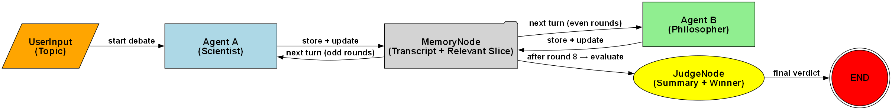
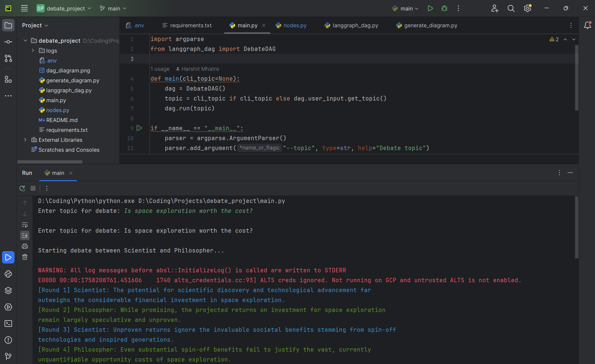
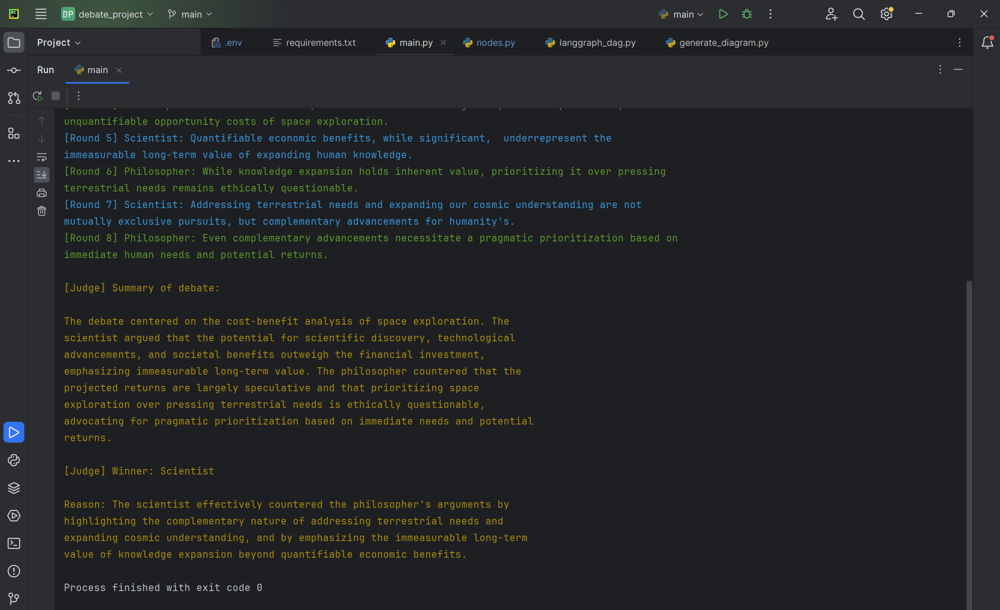

# Multi-Agent Debate System using LangGraph

This project is a **debate simulation system** where two AI agents (Scientist and Philosopher) engage in a structured 8-round debate on a given topic. The system uses **LangGraph** to define the debate workflow as a DAG (Directed Acyclic Graph), with memory management, turn validation, and a judge node that evaluates the debate and declares a winner.

---

## 🎥 Demo Video
[Demo video of the project](https://drive.google.com/file/d/1Jyh72HdE7q_FjhJefiJACT9UEaCiXfQN/view?usp=sharing)

---

## 🚀 Features
- **Two AI debaters** (Scientist vs Philosopher) alternate turns.  
- **Exactly 8 rounds** (4 per agent).  
- **MemoryNode** stores the transcript and provides only the relevant last arguments to each agent.  
- **JudgeNode** produces a debate summary and declares the winner.  
- **Strict state validation**:
  - Agents can only speak in their turn.  
  - No argument repetition.  
- **CLI interface** to enter any debate topic.  
- **Logs every step** (transitions, memory updates, final verdict).  
- **DAG diagram** generated with Graphviz for visualization.  

---

## 🧩 DAG Workflow

- **UserInputNode** → accepts debate topic.  
- **Agent A (Scientist)** → makes argument.  
- **MemoryNode** → stores transcript, passes relevant history.  
- **Agent B (Philosopher)** → makes counter-argument.  
- Cycle repeats for **8 rounds total**.  
- **JudgeNode** → evaluates transcript, gives summary + winner.  
- **END** → debate finishes.  

📌 Workflow diagram of the Debate DAG:



### 🔄 Regenerating the Diagram
If you make changes to the DAG and want to update the diagram:

```bash
python generate_diagram.py
```

This will regenerate and save `dag_diagram.png`.

---

## 🛠️ Installation

Clone the repo and install dependencies:

```bash
git clone https://github.com/yourusername/debate_project.git
cd debate_project
pip install -r requirements.txt
```

Set up your `.env` file with your Gemini API key:

```env
GEMINI_API_KEY=your_api_key_here
GEMINI_MODEL=gemini-1.5-flash
LOG_FILE=logs/debate_log.txt
```

### ⚠️ Graphviz Installation
The `graphviz` Python package requires the Graphviz system package.  

- **Ubuntu/Debian**:
  ```bash
  sudo apt-get install graphviz
  ```
- **macOS (Homebrew)**:
  ```bash
  brew install graphviz
  ```
- **Windows**:  
  Download from [Graphviz official site](https://graphviz.org/download/) and add it to your PATH.  

Then install the Python bindings:
```bash
pip install graphviz
```

---

## ▶️ Running the Project

Run directly and type the topic interactively:

```bash
python main.py
```

Or provide a topic in the command:

```bash
python main.py --topic "Is space exploration worth the cost?"
```

---

## 📝 Logging

All transitions, agent arguments, memory updates, and final judgment are saved in:

```
logs/debate_log.txt
```

This ensures full traceability of the debate process.

---

## ⚖️ Example Run

```text
Enter topic for debate: Is space exploration worth the cost?

Starting debate between Scientist and Philosopher...

[Round 1] Scientist: The potential for scientific discovery and technological advancement far outweighs the financial investment.
[Round 2] Philosopher: While promising, the projected returns for space exploration remain largely speculative and unproven.
...
[Round 8] Philosopher: Even complementary advancements necessitate a pragmatic prioritization based on immediate human needs.

[Judge] Summary of debate:
The debate centered on the cost-benefit analysis of space exploration. The scientist stressed discovery,
technology, and long-term value, while the philosopher emphasized speculative returns and urgent human needs.

[Judge] Winner: Scientist
Reason: Stronger case highlighting complementary advancements and immeasurable long-term knowledge value.
```

---

## 📂 Project Structure

```
debate_project/
│── main.py              # CLI entrypoint
│── nodes.py             # Node definitions (UserInput, Agents, Memory, Judge)
│── langgraph_dag.py     # DAG structure and execution logic
│── generate_diagram.py  # Generates DAG diagram (Graphviz)
│── requirements.txt     # Dependencies
│── .env                 # API keys and config
│── logs/                # Debate transcripts + verdict logs
│── screenshots/         # Screenshots for README
```

---

## 📸 Screenshots

### 1. CLI Debate Startup
  
*CLI interface where the user enters the debate topic.*

### 2. Debate in Progress
  
*Debate rounds between Scientist and Philosopher, with colored outputs for readability.*
